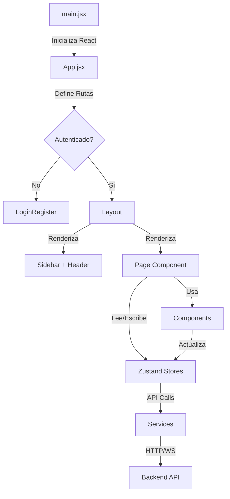

# 📁 Estructura del Proyecto Futurismo

## 📋 Índice

- [Archivos de Configuración](#archivos-de-configuración)
- [Estructura de Carpetas](#estructura-de-carpetas)
- [Componentes](#componentes)
- [Páginas](#páginas)
- [Stores (Estado Global)](#stores-estado-global)
- [Servicios](#servicios)
- [Utilidades](#utilidades)
- [Flujo de la Aplicación](#flujo-de-la-aplicación)

## 🔧 Archivos de Configuración

| Archivo                | Descripción                                            |
| ---------------------- | ------------------------------------------------------- |
| `package.json`       | Dependencias del proyecto y scripts de NPM              |
| `vite.config.js`     | Configuración del bundler Vite para desarrollo y build |
| `tailwind.config.js` | Configuración de TailwindCSS (colores, temas, etc.)    |
| `postcss.config.js`  | Configuración de PostCSS para procesar Tailwind        |
| `index.html`         | Punto de entrada HTML de la aplicación                 |
| `.env`               | Variables de entorno (API URLs, keys, etc.)             |
| `.env.example`       | Plantilla de variables de entorno                       |

## 📂 Estructura de Carpetas

### `/src` - Código Fuente Principal

```
src/
├── components/     # Componentes reutilizables
├── pages/          # Páginas/Vistas principales
├── stores/         # Estado global (Zustand)
├── services/       # Servicios y APIs
├── utils/          # Utilidades y helpers
├── hooks/          # Custom React hooks
├── locales/        # Archivos de traducción i18n
├── data/           # Datos mock para desarrollo
├── styles/         # Estilos globales CSS
├── App.jsx         # Componente raíz con rutas
└── main.jsx        # Punto de entrada React
```

## 🧩 Componentes

### `/components` - Componentes Reutilizables

#### 📁 `/admin` - Componentes Administrativos

- `ReservationStats.jsx` → Estadísticas y métricas de reservas

#### 📁 `/agenda` - Sistema de Agenda/Calendario

- `AdminAgendaView.jsx` → Vista de agenda para administradores
- `AdminAvailabilityView.jsx` → Vista de disponibilidad general
- `FreelanceAgenda.jsx` → Agenda para guías freelance
- `FreelancePersonalAgenda.jsx` → Agenda personal del guía

#### 📁 `/assignments` - Asignación de Tours

- `AssignmentManager.jsx` → Gestor principal de asignaciones
- `TourAssignmentBrochure.jsx` → Generador de folletos de tour
- `TourAssignmentBrochurePDF.jsx` → Versión PDF del folleto

#### 📁 `/auth` - Autenticación

- `ProtectedRoute.jsx` → HOC para proteger rutas por rol de usuario

#### 📁 `/calendar` - Calendario Estilo Fantastical

```
calendar/
├── EventComponents/       # Componentes de eventos
│   ├── AllDayEvent.jsx   # Eventos de día completo
│   ├── EventBlock.jsx    # Bloque visual de evento
│   └── EventTooltip.jsx  # Tooltip con detalles
├── Input/                # Modales de entrada
│   ├── FloatingAddButton.jsx    # Botón flotante "+"
│   ├── QuickAddModal.jsx        # Modal rápido de creación
│   ├── QuickEditModal.jsx       # Modal de edición
│   └── WorkingHoursModal.jsx    # Config. horario laboral
├── Sidebar/              # Panel lateral
│   ├── CalendarSidebar.jsx      # Sidebar principal
│   ├── FilterPanel.jsx          # Panel de filtros
│   └── MiniCalendar.jsx         # Mini calendario
└── Views/                # Vistas principales
    ├── DayView.jsx       # Vista diaria
    ├── MonthView.jsx     # Vista mensual
    └── WeekView.jsx      # Vista semanal
```

#### 📁 `/chat` - Sistema de Mensajería

- `ChatContainer.jsx` → Contenedor principal del sistema de chat
- `ChatList.jsx` → Lista de conversaciones activas
- `ChatWindow.jsx` → Ventana individual de conversación

#### 📁 `/common` - Componentes Globales

- `Layout.jsx` → Layout principal con sidebar y header
- `Header.jsx` → Cabecera con notificaciones y perfil
- `Sidebar.jsx` → Menú lateral de navegación
- `LoadingSpinner.jsx` → Indicador de carga animado
- `ErrorBoundary.jsx` → Captura errores de React
- `ExportModal.jsx` → Modal para exportar datos
- `GuideAvailability.jsx` → Widget de disponibilidad de guía
- `LanguageToggle.jsx` → Selector de idioma
- `ImageUpload.jsx` → Componente de carga de imágenes
- `PhotoUpload.jsx` → Carga múltiple de fotos

#### 📁 `/dashboard` - Componentes del Dashboard

- `StatsCard.jsx` → Tarjetas de estadísticas
- `ServiceChart.jsx` → Gráficos de servicios (Chart.js)
- `RecentActivity.jsx` → Feed de actividad reciente
- `QuickActions.jsx` → Acciones rápidas
- `ExportPanel.jsx` → Panel de exportación de datos

#### 📁 `/emergency` - Protocolos de Emergencia

- `MaterialsManager.jsx` → Gestor de materiales de emergencia
- `ProtocolEditor.jsx` → Editor de protocolos
- `ProtocolViewer.jsx` → Visor de protocolos

#### 📁 `/feedback` - Sistema de Feedback

- `FeedbackDashboard.jsx` → Panel principal de feedback
- `FeedbackModal.jsx` → Modal para dar feedback
- `ServiceAreaFeedback.jsx` → Feedback por área de servicio
- `StaffFeedback.jsx` → Feedback del personal
- `SuggestionTracker.jsx` → Seguimiento de sugerencias

#### 📁 `/guides` - Gestión de Guías

- `GuideForm.jsx` → Formulario de alta/edición de guía
- `GuideProfile.jsx` → Perfil completo del guía

#### 📁 `/marketplace` - Marketplace de Guías Freelance

- `GuideMarketplaceCard.jsx` → Tarjeta de presentación del guía
- `MarketplaceFilters.jsx` → Filtros de búsqueda avanzados
- `MarketplaceSearch.jsx` → Barra de búsqueda
- `GuideAvailabilityCalendar.jsx` → Calendario de disponibilidad

#### 📁 `/monitoring` - Monitoreo en Tiempo Real

- `LiveMap.jsx` → Mapa interactivo con Leaflet
- `LiveMapCDN.jsx` → Versión CDN del mapa
- `LiveMapSimple.jsx` → Versión simplificada
- `GuideTracker.jsx` → Rastreador GPS de guías
- `TourProgress.jsx` → Progreso del tour en tiempo real

#### 📁 `/profile` - Secciones del Perfil

- `AccountStatusSection.jsx` → Estado de la cuenta
- `CompanyDataSection.jsx` → Datos de la empresa
- `ContactDataSection.jsx` → Información de contacto
- `DocumentsSection.jsx` → Documentos y certificados
- `FeedbackSection.jsx` → Sección de feedback recibido
- `FeedbackSectionSimple.jsx` → Versión simplificada
- `PaymentDataSection.jsx` → Información de pago

#### 📁 `/providers` - Gestión de Proveedores

- `ProvidersManager.jsx` → Gestor principal de proveedores
- `ProviderCard.jsx` → Tarjeta de proveedor
- `ProviderForm.jsx` → Formulario de proveedor
- `ProviderAssignment.jsx` → Asignación de proveedores
- `LocationTree.jsx` → Árbol jerárquico de ubicaciones

#### 📁 `/ratings` - Sistema de Calificaciones

- `RatingDashboard.jsx` → Panel de calificaciones
- `RatingModal.jsx` → Modal para calificar
- `ServiceAreaRating.jsx` → Rating por área
- `ServiceRatingModal.jsx` → Modal específico de servicio
- `StaffEvaluation.jsx` → Evaluación del personal
- `TouristRating.jsx` → Calificación de turistas

#### 📁 `/reservations` - Sistema d

#### e Reservas

- `ReservationWizard.jsx` → Wizard paso a paso para reservar
- `ReservationList.jsx` → Lista de reservas con filtros
- `ReservationDetail.jsx` → Detalle completo de reserva
- `ReservationCalendar.jsx` → Calendario de reservas
- `DayTimelineView.jsx` → Vista timeline del día
- `AdvancedFilters.jsx` → Filtros avanzados de búsqueda
- `WhatsAppConsultButton.jsx` → Botón de consulta por WhatsApp

#### 📁 `/settings` - Configuraciones

- `GeneralSettings.jsx` → Configuraciones generales
- `ToursSettings.jsx` → Configuración de tours
- `NotificationsSettings.jsx` → Preferencias de notificaciones

#### 📁 `/users` - Gestión de Usuarios

- `UserForm.jsx` → Formulario completo de usuario
- `UserFormSimple.jsx` → Formulario simplificado
- `UserList.jsx` → Lista de usuarios con acciones

## 📄 Páginas

### `/pages` - Páginas Principales

| Página                    | Ruta                 | Descripción                      | Roles         |
| -------------------------- | -------------------- | --------------------------------- | ------------- |
| `LoginRegister.jsx`      | `/login`           | Login y registro de usuarios      | Público      |
| `Dashboard.jsx`          | `/dashboard`       | Dashboard principal               | Todos         |
| `Monitoring.jsx`         | `/monitoring`      | Monitoreo de tours en tiempo real | Todos         |
| `Reservations.jsx`       | `/reservations`    | Gestión de reservas              | Agency, Admin |
| `History.jsx`            | `/history`         | Historial de servicios            | Todos         |
| `Profile.jsx`            | `/profile`         | Perfil de usuario/empresa         | Todos         |
| `Chat.jsx`               | `/chat`            | Sistema de mensajería            | Todos         |
| `Agenda.jsx`             | `/agenda`          | Agenda y calendario               | Guide, Admin  |
| `TourAssignments.jsx`    | `/assignments`     | Asignación de tours              | Admin         |
| `Providers.jsx`          | `/providers`       | Gestión de proveedores           | Admin         |
| `EmergencyProtocols.jsx` | `/emergency`       | Protocolos de emergencia          | Guide, Admin  |
| `GuidesManagement.jsx`   | `/guides`          | Gestión de guías                | Admin         |
| `Settings.jsx`           | `/settings`        | Configuraciones del sistema       | Admin         |
| `Users.jsx`              | `/users`           | Gestión de usuarios              | Admin         |
| `AgencyCalendar.jsx`     | `/agency/calendar` | Calendario de agencia             | Agency, Admin |
| `AgencyReports.jsx`      | `/agency/reports`  | Reportes de agencia               | Agency, Admin |
| `AgencyPoints.jsx`       | `/agency/points`   | Sistema de puntos                 | Agency, Admin |

### `/pages/admin` - Páginas Administrativas

| Página                       | Ruta                    | Descripción                  |
| ----------------------------- | ----------------------- | ----------------------------- |
| `ReservationManagement.jsx` | `/admin/reservations` | Gestión avanzada de reservas |
| `Reports.jsx`               | `/admin/reports`      | Reportes administrativos      |

### `/pages/guide` - Páginas para Guías

| Página                    | Ruta                | Descripción             | Tipo Guía |
| -------------------------- | ------------------- | ------------------------ | ---------- |
| `FinancialDashboard.jsx` | `/guide/finances` | Dashboard financiero     | Freelance  |
| `GuideTourView.jsx`      | `/guide/tour/:id` | Vista del tour del guía | Todos      |

### `/pages/marketplace` - Páginas del Marketplace

| Página                            | Ruta                             | Descripción                  | Roles             |
| ---------------------------------- | -------------------------------- | ----------------------------- | ----------------- |
| `GuidesMarketplace.jsx`          | `/marketplace`                 | Catálogo de guías freelance | Agency, Admin     |
| `GuideMarketplaceProfile.jsx`    | `/marketplace/guide/:id`       | Perfil público del guía     | Agency, Admin     |
| `ServiceRequestForm.jsx`         | `/marketplace/book/:id`        | Formulario de solicitud       | Agency, Admin     |
| `ServiceRequestDetail.jsx`       | `/marketplace/requests/:id`    | Detalle de solicitud          | Todos             |
| `ServiceReview.jsx`              | `/marketplace/review/:id`      | Reseña de servicio           | Agency, Admin     |
| `AgencyMarketplaceDashboard.jsx` | `/marketplace/requests`        | Dashboard de solicitudes      | Agency, Admin     |
| `GuideMarketplaceDashboard.jsx`  | `/marketplace/guide-dashboard` | Dashboard del guía           | Guide (Freelance) |

## 🗄️ Stores (Estado Global)

### `/stores` - Gestión de Estado con Zustand

| Store                         | Descripción             | Estado que Maneja                  |
| ----------------------------- | ------------------------ | ---------------------------------- |
| `authStore.js`              | Autenticación y sesión | token, user, isAuthenticated       |
| `servicesStore.js`          | Servicios y tours        | services, activeServices, filters  |
| `reservationsStore.js`      | Sistema de reservas      | reservations, formData, validation |
| `notificationsStore.js`     | Notificaciones           | notifications, unreadCount         |
| `guidesStore.js`            | Gestión de guías       | guides, availability, schedules    |
| `marketplaceStore.js`       | Marketplace              | freelanceGuides, requests, reviews |
| `providersStore.js`         | Proveedores              | providers, locations, assignments  |
| `settingsStore.js`          | Configuraciones          | company, business rules, features  |
| `usersStore.js`             | Usuarios del sistema     | users, permissions, roles          |
| `emergencyStore.js`         | Protocolos emergencia    | protocols, materials, contacts     |
| `agencyStore.js`            | Datos de agencias        | agencies, credits, points          |
| `independentAgendaStore.js` | Agenda independiente     | events, availability               |

## 🔌 Servicios

### `/services` - APIs y Servicios Externos

| Servicio                   | Descripción          | Funciones Principales           |
| -------------------------- | --------------------- | ------------------------------- |
| `api.js`                 | Cliente HTTP Axios    | Interceptores, manejo de tokens |
| `websocket.js`           | Cliente WebSocket     | Conexión tiempo real, eventos  |
| `mapService.js`          | Servicios de mapas    | Geocoding, rutas, distancias    |
| `pdfService.js`          | Generación de PDFs   | Reservas, reportes, facturas    |
| `pdfServiceSimple.js`    | PDFs simplificados    | Versión ligera para móviles   |
| `exportService.js`       | Exportación de datos | Excel, CSV, PDF                 |
| `emergencyPDFService.js` | PDFs de emergencia    | Protocolos, contactos           |

## 🛠️ Utilidades

### `/utils` - Funciones Helper

| Archivo           | Descripción        | Funciones                               |
| ----------------- | ------------------- | --------------------------------------- |
| `constants.js`  | Constantes globales | STATUS, ROLES, API_ENDPOINTS            |
| `formatters.js` | Formateo de datos   | formatDate, formatCurrency, formatPhone |
| `validators.js` | Validaciones        | validateEmail, validateRUC, validateDNI |
| `i18n.js`       | Configuración i18n | Idiomas, detección automática         |

### `/utils/validationSchemas` - Esquemas de Validación

| Archivo                   | Descripción                      |
| ------------------------- | --------------------------------- |
| `marketplaceSchemas.js` | Validaciones Yup para marketplace |

## 🌐 Localización

### `/locales` - Archivos de Traducción

| Archivo     | Idioma   |
| ----------- | -------- |
| `es.json` | Español |
| `en.json` | Inglés  |

## 🎣 Hooks Personalizados

### `/hooks` - Custom React Hooks

| Hook                        | Descripción               | Uso                          |
| --------------------------- | -------------------------- | ---------------------------- |
| `useKeyboardShortcuts.js` | Atajos de teclado globales | Ctrl+K búsqueda, Esc cerrar |

## 🎯 Flujo de la Aplicación



## 📱 Responsividad

- **Mobile First**: Diseñado primero para móviles
- **Breakpoints**: sm (640px), md (768px), lg (1024px), xl (1280px)
- **Componentes Adaptables**: Sidebar colapsable, tablas scrollables

## 🔐 Seguridad y Roles

### Roles del Sistema

1. **Admin**: Acceso total al sistema
2. **Agency**: Gestión de reservas y monitoreo
3. **Guide**:
   - Planta: Empleado fijo
   - Freelance: Independiente con marketplace

### Rutas Protegidas

- Todas las rutas requieren autenticación excepto `/login`
- Rutas específicas por rol usando `ProtectedRoute`
- Redirección automática según permisos

## 🚀 Scripts Disponibles

```bash
# Desarrollo
npm run dev          # Servidor de desarrollo
npm run build        # Build de producción
npm run preview      # Preview del build

# Limpieza
npm run clean        # Limpiar cache (Linux/Mac)
npm run clean:win    # Limpiar cache (Windows)
npm run start:fresh  # Inicio limpio
```

## 📦 Dependencias Principales

- **React 18.3.1**: Framework UI
- **Vite 5.4.0**: Build tool
- **Zustand 4.5.0**: Estado global
- **React Router 6.24.0**: Navegación
- **TailwindCSS 3.4.1**: Estilos
- **Axios**: Cliente HTTP
- **Socket.io-client**: WebSocket
- **Leaflet**: Mapas (via React-Leaflet)
- **Chart.js**: Gráficos (via Recharts)
- **React Hook Form**: Formularios
- **Yup**: Validación de esquemas
- **date-fns**: Manipulación de fechas
- **i18next**: Internacionalización
