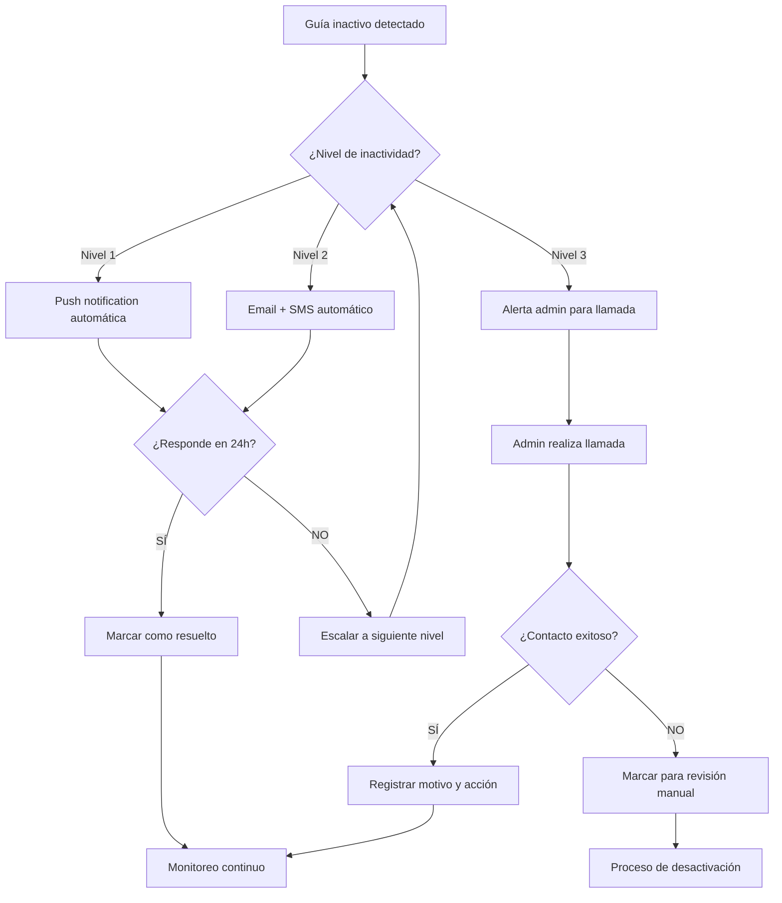
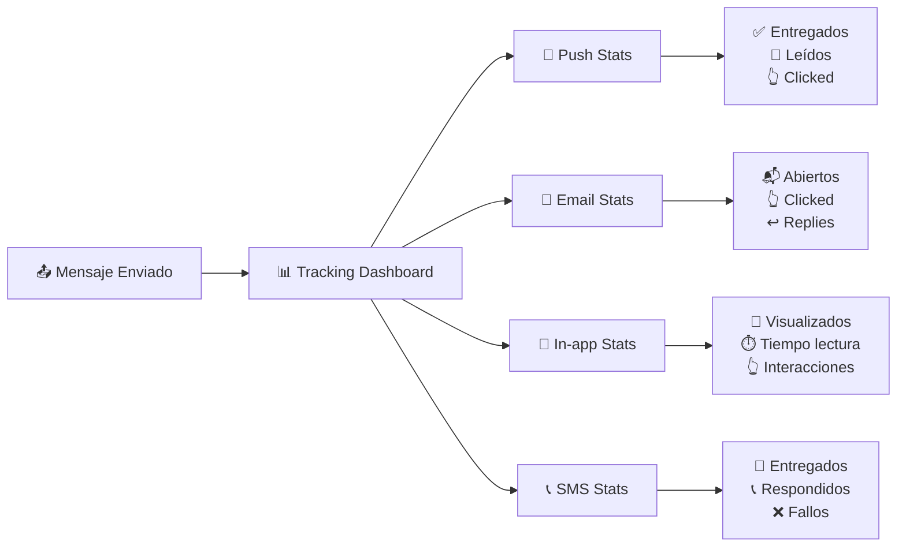
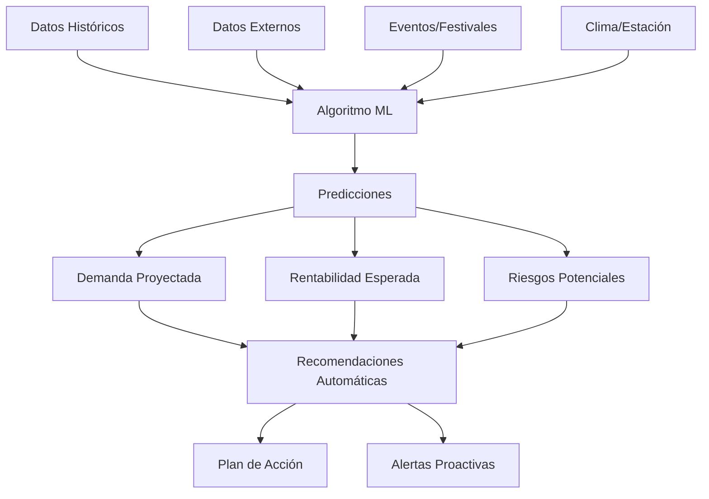

# 📋 CASOS DE USO - PLATAFORMA TURÍSTICA B2B

## 🔐 **ROLES DEL SISTEMA**
- **Administrador**: Gestión completa del sistema
- **Agencia B2B**: Venta de tours a turistas
- **Guía Planta**: Empleado fijo de agencia
- **Guía Freelance**: Guía independiente en marketplace

---

## 👑 **ADMINISTRADOR**

### **📊 Monitoreo Diario**
**Como administrador, necesito:**
- Ver cuántos tours están activos **en tiempo real**
- Identificar emergencias o problemas **inmediatos**
- Saber qué guías no se conectaron hoy
- Monitorear qué agencias están operando activamente
- Ver alertas de tours retrasados o cancelados
- Verificar que todos los tours tengan guías asignados

### **💰 Control Financiero**
**Como administrador, necesito:**
- Conocer las comisiones cobradas **esta semana/mes**
- Identificar qué agencias tienen pagos pendientes
- Calcular el ticket promedio por reserva
- Analizar qué porcentaje de comisión ganamos por servicio
- Ver ingresos por tipo de tour (grupal, privado, actividades)
- Comparar ingresos mensuales para detectar tendencias

### **🚨 Gestión de Problemas**
**Como administrador, necesito:**
- Ver tours con problemas **RIGHT NOW**
- Identificar guías que cancelaron último momento
- Gestionar quejas de turistas sin resolver
- Monitorear agencias con mal rating
- Resolver conflictos entre agencias y guías
- Manejar emergencias durante tours activos

### **📈 Toma de Decisiones**
**Como administrador, necesito:**
- Analizar qué rutas son más rentables
- Identificar guías de alto rendimiento para promocionar
- Planificar personal para temporadas altas/bajas
- Decidir qué servicios eliminar o mejorar
- Evaluar el desempeño de agencias registradas
- Optimizar la distribución de tours por zona

### **⚡ Acciones Inmediatas**
**Como administrador, puedo:**
- Contactar guías que no responden
- Reasignar tours cancelados a otros guías
- Aprobar/rechazar solicitudes de agencias nuevas
- Ver ubicación en tiempo real de todos los tours activos
- Suspender usuarios que incumplen políticas
- Enviar notificaciones masivas al sistema

---

## 🏢 **AGENCIA B2B**

### **💼 Gestión de Reservas**
**Como agencia, necesito:**
- Crear reservas para mis clientes de forma rápida
- Ver disponibilidad de guías por fecha y zona
- Asignar guías específicos a tours programados
- Modificar reservas existentes (fecha, hora, participantes)
- Cancelar reservas con políticas claras de reembolso
- Gestionar lista de espera para tours populares

### **👥 Gestión de Clientes**
**Como agencia, necesito:**
- Mantener base de datos de mis clientes frecuentes
- Crear paquetes personalizados para grupos corporativos
- Enviar confirmaciones y recordatorios automáticos
- Gestionar requisitos especiales (dietas, accesibilidad)
- Registrar preferencias de clientes para futuras ventas
- Manejar documentación requerida (pasaportes, seguros)

### **📊 Control de Ventas**
**Como agencia, necesito:**
- Ver mis ingresos diarios, semanales y mensuales
- Analizar qué tours vendo más y cuáles menos
- Comparar mi rendimiento con períodos anteriores
- Calcular mi margen de ganancia por tour
- Identificar mis mejores meses para planificar ofertas
- Exportar reportes para mi contabilidad

### **🤝 Relación con Guías**
**Como agencia, necesito:**
- Buscar guías disponibles en el marketplace
- Ver perfiles detallados con ratings y experiencia
- Contactar guías directamente para cotizaciones
- Mantener lista de guías preferidos/favoritos
- Calificar guías después de cada servicio
- Negociar tarifas especiales por volumen

### **📱 Monitoreo en Tiempo Real**
**Como agencia, necesito:**
- Ver ubicación de mis tours activos
- Recibir notificaciones de inicio/fin de tours
- Contactar guías durante el servicio si hay problemas
- Recibir alertas de emergencias o retrasos
- Verificar que tours se completen según lo programado
- Acceder a fotos/reportes del guía durante el tour

---

## 🗺️ **GUÍA PLANTA (Empleado)**

### **📅 Gestión de Agenda**
**Como guía planta, necesito:**
- Ver mis tours asignados por mi agencia
- Confirmar disponibilidad para fechas propuestas
- Solicitar cambios de horario cuando sea necesario
- Ver detalles completos de cada tour (participantes, ruta, duración)
- Acceder a información de contacto de emergencia
- Notificar enfermedad o indisponibilidad con anticipación

### **🎯 Ejecución de Tours**
**Como guía planta, necesito:**
- Acceder a scripts y puntos de interés de cada ruta
- Marcar inicio y fin de tours en el sistema
- Compartir ubicación en tiempo real durante tours
- Subir fotos del grupo durante el recorrido
- Reportar incidentes o problemas inmediatamente
- Contactar a la agencia en caso de emergencias

### **📈 Desarrollo Profesional**
**Como guía planta, necesito:**
- Ver mis calificaciones y comentarios de turistas
- Acceder a materiales de capacitación actualizados
- Conocer nuevas rutas o atracciones disponibles
- Participar en entrenamientos de protocolos de seguridad
- Reportar problemas en rutas o atracciones
- Solicitar certificaciones adicionales

### **💬 Comunicación**
**Como guía planta, necesito:**
- Chat directo con mi agencia asignada
- Recibir notificaciones importantes del sistema
- Reportar feedback de turistas sobre servicios
- Coordinar con otros guías en tours grupales grandes
- Acceder a contactos de emergencia 24/7
- Enviar reportes post-tour a la agencia

---

## 🌟 **GUÍA FREELANCE (Independiente)**

### **🛍️ Marketplace y Perfil**
**Como guía freelance, necesito:**
- Crear perfil atractivo con fotos y videos
- Definir mis especialidades y zonas de trabajo
- Establecer tarifas competitivas por tipo de servicio
- Mantener calendario de disponibilidad actualizado
- Gestionar mi portfolio de tours realizados
- Optimizar mi perfil para aparecer en búsquedas

### **💼 Gestión de Servicios**
**Como guía freelance, necesito:**
- Recibir solicitudes de múltiples agencias
- Cotizar servicios personalizados rápidamente
- Aceptar/rechazar trabajos según mi disponibilidad
- Negociar tarifas especiales para grupos grandes
- Gestionar contratos con múltiples agencias
- Establecer políticas claras de cancelación

### **💳 Control Financiero**
**Como guía freelance, necesito:**
- Ver mis ingresos por agencia y período
- Gestionar pagos pendientes de diferentes agencias
- Establecer y modificar mis tarifas por temporada
- Exportar información fiscal para declaraciones
- Analizar qué agencias me dan más trabajo
- Comparar mis tarifas con otros guías similares

### **⭐ Reputación y Marketing**
**Como guía freelance, necesito:**
- Mantener rating alto para aparecer en primeros resultados
- Gestionar reseñas y responder comentarios
- Promocionar servicios especiales (fotografía, gastronomía)
- Crear paquetes únicos que me diferencien
- Mantener certificaciones actualizadas
- Desarrollar relaciones a largo plazo con agencias

### **🔧 Herramientas de Trabajo**
**Como guía freelance, necesito:**
- Sistema de puntos/recompensas por buen desempeño
- Acceso a recursos de capacitación continua
- Herramientas para crear cotizaciones profesionales
- Calendario integrado con múltiples agencias
- Sistema de comunicación centralizado
- Backup de contactos y documentación importante

---

## 🎯 **MÉTRICAS CLAVE POR ROL**

### **📊 Administrador**
- **Ingresos por comisiones**: Mes actual vs anterior
- **Tours activos**: Número en tiempo real
- **Tours completados a tiempo**: % tours finalizados sin retrasos >30min
- **Tours sin cancelaciones**: % tours que no se cancelaron último momento
- **Tours sin emergencias**: % tours completados sin incidentes de seguridad
- **Crecimiento de usuarios**: Nuevas agencias y guías por mes
- **Tiempo de respuesta**: Promedio de resolución de problemas
- **Satisfacción general**: Rating promedio del sistema

### **🏢 Agencia B2B**
- **Ventas mensuales**: Ingresos brutos y netos
- **Tasa de conversión**: Cotizaciones → Reservas confirmadas
- **Tours completados**: % de tours sin cancelaciones
- **Rating promedio**: Calificación de turistas
- **Guías favoritos**: Frecuencia de contratación
- **Eficiencia operativa**: Tiempo promedio de gestión por reserva

### **🗺️ Guía Planta**
- **Tours asignados**: Número semanal/mensual
- **Rating personal**: Calificación promedio de turistas
- **Puntualidad**: % de tours iniciados a tiempo
- **Cumplimiento**: % de tours completados exitosamente
- **Feedback positivo**: Comentarios destacados
- **Capacitación**: Horas de entrenamiento completadas

### **🌟 Guía Freelance**
- **Ingresos mensuales**: Total y por agencia
- **Solicitudes recibidas**: Número y tasa de aceptación
- **Rating marketplace**: Posición en búsquedas
- **Agencias activas**: Número de agencias que me contratan
- **Repetición de clientes**: % de agencias que me vuelven a contratar
- **Crecimiento**: Evolución de ingresos mes a mes

---

## 🔄 **FLUJOS DE INTERACCIÓN**

### **Flujo: Crear Reserva**
1. **Agencia** crea reserva con detalles
2. **Sistema** busca guías disponibles
3. **Agencia** selecciona guía (planta/freelance)
4. **Guía** recibe notificación y confirma
5. **Sistema** genera confirmación para todos
6. **Día del tour**: Monitoreo en tiempo real
7. **Post-tour**: Calificaciones y reportes

### **Flujo: Emergencia Durante Tour**
1. **Guía** reporta emergencia desde app
2. **Sistema** alerta automáticamente a agencia y admin
3. **Admin** coordina respuesta y recursos
4. **Agencia** informa a clientes/familiares
5. **Sistema** registra incidente para seguimiento
6. **Post-emergencia**: Análisis y mejoras

### **Flujo: Marketplace Freelance**
1. **Guía freelance** completa perfil
2. **Admin** verifica y aprueba perfil
3. **Agencia** busca guías para servicio específico
4. **Sistema** muestra guías relevantes ordenados por rating
5. **Agencia** contacta y negocia con guía
6. **Guía** acepta y confirma servicio
7. **Post-servicio**: Calificaciones mutuas

---

## 📞 **CU-ADM-010: SISTEMA DE CONTACTO POR INACTIVIDAD DE GUÍAS**

### **Descripción**
Como administrador, necesito un sistema automatizado para identificar y contactar guías inactivos que no se han conectado o no han aceptado trabajos, manteniendo la operatividad y disponibilidad del servicio.

### **Actor Principal**: Administrador
### **Actores Secundarios**: Guías (Planta/Freelance), Sistema de Notificaciones

### **Precondiciones**:
- Usuario autenticado como administrador
- Sistema con historial de actividad de guías
- Configuración de umbrales de inactividad definidos
- Sistema de comunicación operativo (email, SMS, push notifications)

### **Flujo Principal**:

#### **1. Dashboard de Monitoreo de Actividad**
```
🔍 ESTADO DE GUÍAS - TIEMPO REAL
───────────────────────────────────────
🟢 Activos hoy: 28 guías (73%)
🟡 Inactivos 2-3 días: 8 guías (21%) 
🔴 Inactivos +4 días: 2 guías (5%)
⚫ Sin conexión 7+ días: 1 guía (3%)
```

#### **2. Filtros y Categorización Automática**
El sistema clasifica automáticamente por niveles de inactividad:

- **🟢 NIVEL 0 - Activos** (última conexión <24h)
  - Estado: Normal
  - Acción: Ninguna

- **🟡 NIVEL 1 - Alerta Temprana** (2-3 días sin actividad)
  - Trigger: Notificación push suave
  - Mensaje: "¡Hola! ¿Todo bien? Hay nuevas oportunidades disponibles"

- **🟠 NIVEL 2 - Seguimiento** (4-6 días sin actividad)
  - Trigger: Email + SMS
  - Acción manual: Admin puede contactar personalmente

- **🔴 NIVEL 3 - Crítico** (7+ días sin actividad)
  - Trigger: Llamada telefónica obligatoria
  - Escalación: Marcar como "Posible baja"

#### **3. Panel de Acción Inmediata**
```
📱 ACCIONES RÁPIDAS POR GUÍA
─────────────────────────────

María González (⚫ 8 días inactiva)
├─ 📞 Llamar ahora
├─ 📧 Enviar email personalizado  
├─ 💬 WhatsApp/Telegram
├─ 📝 Marcar como "No disponible"
└─ ❌ Desactivar temporalmente

Carlos Ruiz (🔴 5 días inactivo)
├─ 📞 Llamar ahora
├─ 📧 Enviar email estándar
├─ 💬 Mensaje directo en app
└─ ⏰ Programar seguimiento en 2 días
```

#### **4. Plantillas de Comunicación Inteligente**
El sistema sugiere plantillas basadas en el perfil del guía:

**Para Guía Freelance de Alto Rendimiento:**
> "Hola [Nombre], notamos que no te has conectado en [X] días. ¿Todo está bien? Tenemos [N] solicitudes nuevas que podrían interesarte, incluyendo tours premium con excelente remuneración. ¿Necesitas algún tipo de apoyo?"

**Para Guía Planta con Historial Regular:**
> "Buenos días [Nombre], no hemos recibido tu confirmación de disponibilidad. Por favor confirma tu agenda para los próximos días o contacta a tu supervisor inmediato."

**Para Guía Nuevo (menos de 3 meses):**
> "¡Hola [Nombre]! Como parte de nuestro programa de acompañamiento, queremos saber cómo te sientes en la plataforma. ¿Hay algo en lo que podamos ayudarte para que te sientas más cómodo?"

#### **5. Seguimiento y Escalación Automática**


### **Flujos Alternativos**:

#### **FA-010.1: Guía Responde con Problema Personal**
1. Admin registra motivo en sistema
2. Establece período de pausa temporal
3. Programa seguimiento automático
4. Notifica a agencias sobre indisponibilidad temporal

#### **FA-010.2: Guía No Responde Tras 3 Intentos**
1. Sistema marca como "Inactivo confirmado"
2. Retira guía de búsquedas activas
3. Notifica a agencias con reservas pendientes
4. Inicia proceso de reasignación de tours

#### **FA-010.3: Respuesta Automática de Vacaciones**
1. Sistema detecta respuesta automática
2. Parsea fechas de regreso si están disponibles
3. Programa reactivación automática
4. Temporal status: "En vacaciones hasta [fecha]"

### **Postcondiciones**:
- Registro completo de comunicaciones
- Estado actualizado del guía en el sistema
- Agencias notificadas de cambios de disponibilidad
- Métricas de retención actualizadas

### **Criterios de Aceptación**:
```gherkin
ESCENARIO: Detección automática de inactividad
DADO que soy administrador del sistema
CUANDO un guía no se conecta por más de 2 días
ENTONCES el sistema lo clasifica automáticamente por nivel
  Y aparece en mi dashboard de monitoreo
  Y puedo ver su historial de actividad completo
  Y tengo opciones de contacto directo disponibles

ESCENARIO: Comunicación escalada
DADO que un guía está en Nivel 3 (crítico)
CUANDO accedo a su perfil de inactividad
ENTONCES veo todas las comunicaciones previas
  Y tengo plantillas contextuales disponibles
  Y puedo marcar el resultado de mi contacto
  Y el sistema actualiza automáticamente su estado

ESCENARIO: Resolución exitosa
DADO que logro contactar a un guía inactivo
CUANDO marco el caso como resuelto
ENTONCES se registra la comunicación
  Y el guía vuelve al estado activo
  Y se programa monitoreo preventivo
  Y las agencias son notificadas de su disponibilidad
```

### **Métricas de Éxito**:
- **Tasa de reactivación**: >75% de guías contactados vuelven a actividad
- **Tiempo de respuesta**: <24h para contacto de Nivel 2
- **Prevención de bajas**: Reducir 40% las desactivaciones permanentes
- **Satisfacción del guía**: >4.2★ en encuestas post-contacto

### **Dashboard Mockup**:
```
🎯 GESTIÓN DE INACTIVIDAD - VISTA ADMIN
═══════════════════════════════════════════

┌─ RESUMEN EJECUTIVO ─────────────────────┐
│ 📊 Esta semana vs anterior:            │
│ • Reactivaciones: 12 ↗️ (+3)           │
│ • Casos críticos: 2 ↘️ (-1)            │
│ • Tiempo promedio respuesta: 4.2h      │
│ • Tasa éxito contacto: 87%             │
└─────────────────────────────────────────┘

┌─ ACCIONES PENDIENTES ──────────────────┐
│ 📞 Llamadas urgentes (2)               │
│ • María González - 8 días sin conexión │
│   [📞 Llamar ahora] [📝 Ver historial] │
│                                        │
│ • Roberto Silva - 7 días inactivo      │
│   [📞 Llamar ahora] [📝 Ver historial] │
│                                        │
│ ⏰ Seguimientos programados (5)         │
│ • Ana López - Seguimiento en 2h        │
│ • Carlos Ruiz - Seguimiento mañana     │
│ └─ [Ver todos los seguimientos] ───────┘

┌─ FILTROS INTELIGENTES ─────────────────┐
│ 🔍 [Críticos] [Nuevos] [Freelance]     │
│ 📅 [Última semana] [Este mes]          │
│ ⭐ [Alto rendimiento] [Problemáticos]   │
└─────────────────────────────────────────┘
```

### **Integraciones Técnicas**:

#### **APIs Necesarias**:
```javascript
// Monitoreo de actividad
GET /api/admin/guide-activity-monitoring
GET /api/guides/{id}/activity-history
POST /api/admin/contact-inactive-guide
PUT /api/guides/{id}/inactivity-status

// Comunicaciones
POST /api/communications/send-template
GET /api/communications/templates/inactivity
POST /api/communications/log-interaction
```

#### **WebSocket Events**:
```javascript
// Eventos en tiempo real
'guide:activity-change' // Guía cambia estado
'admin:inactivity-alert' // Nueva alerta crítica
'guide:response-received' // Respuesta a comunicación
```

#### **Base de Datos**:
```sql
-- Tabla de seguimiento de inactividad
guide_inactivity_tracking (
  id, guide_id, level, last_contact_date,
  contact_method, response_received, 
  admin_notes, resolution_date
)

-- Tabla de comunicaciones
guide_communications (
  id, guide_id, admin_id, template_used,
  sent_at, response_at, success_rate
)
```

---

## 📢 **CU-ADM-011: SISTEMA DE NOTIFICACIONES MASIVAS**

### **Descripción**
Como administrador, necesito un sistema para enviar notificaciones masivas segmentadas a usuarios específicos (guías, agencias, o ambos) para comunicar actualizaciones importantes, emergencias, o cambios operativos.

### **Actor Principal**: Administrador
### **Actores Secundarios**: Guías, Agencias, Sistema de Notificaciones

### **Precondiciones**:
- Usuario autenticado como administrador con permisos de comunicación masiva
- Base de datos de usuarios actualizada y segmentada
- Sistemas de notificación operativos (Push, Email, SMS)
- Plantillas de comunicación configuradas

### **Flujo Principal**:

#### **1. Centro de Comando de Comunicaciones**
```
📡 CENTRO DE NOTIFICACIONES MASIVAS
═══════════════════════════════════════════

🎯 AUDIENCIA TARGET
├─ 👥 Todos los usuarios (892)
├─ 🏢 Solo agencias (156) 
├─ 🗺️ Solo guías (387)
├─ ⭐ Guías freelance (234)
├─ 🏅 Guías planta (153)
└─ 🔧 Segmentación personalizada

📊 CANALES DISPONIBLES
├─ 📱 Push notification (inmediato)
├─ 📧 Email (profesional)
├─ 💬 In-app message (persistente)
├─ 🔔 Sistema alert (crítico)
└─ 📞 SMS (emergencias únicamente)
```

#### **2. Segmentación Inteligente de Audiencia**
El sistema permite múltiples criterios de segmentación:

**🎯 Segmentación Básica:**
- **Todos los usuarios activos**
- **Solo agencias** (con sub-filtros: premium, estándar, nuevas)
- **Solo guías** (con sub-filtros: freelance, planta, por rating)
- **Administradores** (para comunicaciones internas)

**🎯 Segmentación Avanzada:**
```
┌─ FILTROS GEOGRÁFICOS ──────────────────┐
│ • Ciudad: [Lima] [Cusco] [Arequipa]    │
│ • Zona: [Centro] [Norte] [Sur]         │
│ • Región: [Costa] [Sierra] [Selva]     │
└────────────────────────────────────────┘

┌─ FILTROS DE ACTIVIDAD ─────────────────┐
│ • Activos última semana                │
│ • Inactivos más de X días              │
│ • Con tours programados próximos       │
│ • Con rating superior a X estrellas    │
└────────────────────────────────────────┘

┌─ FILTROS DE COMPORTAMIENTO ────────────┐
│ • Usuarios nuevos (< 30 días)          │
│ • Usuarios frecuentes (> 50 tours)     │
│ • Usuarios con issues recientes        │
│ • Premium/VIP members                  │
└────────────────────────────────────────┘
```

#### **3. Compositor de Mensajes Inteligente**
```
✍️ CREAR NOTIFICACIÓN MASIVA
────────────────────────────────────────

🎨 TIPO DE MENSAJE:
○ 📢 Anuncio general    ○ ⚠️ Alerta importante
○ 🚨 Emergencia         ○ 🎉 Celebración/logro
○ 🔧 Mantenimiento      ○ 📊 Actualización de datos

📝 EDITOR INTELIGENTE:
┌─────────────────────────────────────────┐
│ Asunto: [Actualización importante del sistema] │
│                                         │
│ Mensaje:                                │
│ Estimados {ROLE_GREETING},              │
│                                         │
│ Les informamos que el {DATE} realizaremos │
│ mantenimiento programado que afectará:   │
│                                         │
│ • {AFFECTED_FEATURES}                   │
│ • Duración estimada: {DURATION}        │
│                                         │
│ Gracias por su comprensión.             │
│ Equipo Futurismo                        │
└─────────────────────────────────────────┘

🔮 VARIABLES DINÁMICAS:
• {USER_NAME} - Nombre del usuario
• {ROLE_GREETING} - Saludo según rol
• {CITY} - Ciudad del usuario
• {LAST_LOGIN} - Última conexión
• {PENDING_TOURS} - Tours pendientes
```

#### **4. Programación y Delivery Inteligente**
```
⏰ CONFIGURACIÓN DE ENVÍO
─────────────────────────────────────

📅 TIMING:
○ Enviar ahora (inmediato)
○ Programar para una fecha específica
○ Horario óptimo automático (análisis de actividad)
○ Envío escalonado (evitar saturación)

🌍 ZONAS HORARIAS:
Lima:     14:30 (horario pico usuarios)
Cusco:    14:30 (mismo huso horario)
Arequipa: 14:30 (mismo huso horario)

📊 PREDICCIÓN DE ENTREGA:
• Push notifications: 95% entregadas en 30 segundos
• Emails: 92% abiertos en primeras 2 horas
• In-app messages: 87% visualizados en 24 horas
• SMS: 99% entregados en 60 segundos

🔄 CONFIGURACIÓN DE REINTENTO:
○ Reintentar push notifications fallidas (3 veces)
○ Reenviar email si no se abre en 48h
○ Escalar a SMS si es crítico y no responde
○ Marcar como no entregado después de X intentos
```

#### **5. Dashboard de Seguimiento en Tiempo Real**


### **Tipos de Notificaciones Especializadas**:

#### **🚨 EMERGENCIAS (Nivel Crítico)**
- **Activación automática**: Bypass de horarios normales
- **Canales múltiples**: Push + SMS + Email simultáneos
- **Confirmación obligatoria**: Usuarios deben marcar "recibido"
- **Escalación**: Si no responde en 15min, contactar por teléfono

#### **⚠️ ALERTAS OPERATIVAS (Nivel Alto)**
- **Mantenimientos programados**
- **Cambios en políticas**
- **Actualizaciones de seguridad**
- **Modificaciones de precios**

#### **📢 COMUNICACIONES GENERALES (Nivel Medio)**
- **Nuevas funcionalidades**
- **Eventos especiales**
- **Reconocimientos y premios**
- **Encuestas de satisfacción**

#### **🎉 CELEBRACIONES (Nivel Bajo)**
- **Hitos del sistema** (X usuarios registrados)
- **Cumpleaños de guías destacados**
- **Aniversarios de agencias**
- **Logros colectivos**

### **Flujos Alternativos**:

#### **FA-011.1: Notificación de Emergencia**
1. Admin selecciona "EMERGENCIA" como tipo
2. Sistema requiere confirmación doble
3. Activación de protocolo especial:
   - Envío inmediato a TODOS los canales
   - Bypass de configuraciones de horario
   - Tracking agresivo de confirmaciones
   - Escalación automática a llamadas si no responden

#### **FA-011.2: Programación para Múltiples Zonas**
1. Admin programa mensaje para horario específico
2. Sistema calcula horario óptimo para cada zona
3. Envío escalonado respetando zonas horarias
4. Consolidación de métricas por región

#### **FA-011.3: Personalización por Rol**
1. Admin crea mensaje base
2. Sistema permite versiones específicas por rol:
   - **Para Agencias**: Enfoque en impacto de negocio
   - **Para Guías**: Enfoque en operaciones y seguridad
   - **Para Freelance**: Enfoque en oportunidades
3. Envío con plantilla adecuada por segmento

### **Postcondiciones**:
- Mensaje enviado a audiencia segmentada
- Métricas de entrega y engagement tracked
- Respuestas y feedback registrados
- Usuarios informados según criticidad del mensaje

### **Criterios de Aceptación**:
```gherkin
ESCENARIO: Envío de notificación masiva estándar
DADO que soy administrador del sistema
CUANDO creo una notificación para "Solo agencias"
ENTONCES puedo segmentar por ciudad, actividad y tipo
  Y puedo previsualizar el mensaje antes de enviar
  Y veo estimación de usuarios que recibirán el mensaje
  Y puedo programar el envío para horario óptimo
  Y recibo confirmación cuando se complete el envío

ESCENARIO: Emergencia crítica
DADO que tengo una emergencia que comunicar
CUANDO selecciono tipo "EMERGENCIA"
ENTONCES el sistema requiere confirmación doble
  Y se activan todos los canales simultáneamente
  Y se bypass cualquier configuración de horarios
  Y puedo ver en tiempo real quién ha confirmado recepción
  Y se escala automáticamente si usuarios no responden

ESCENARIO: Seguimiento de efectividad
DADO que envié una notificación masiva
CUANDO accedo al dashboard de seguimiento
ENTONCES veo métricas de entrega por canal
  Y veo tasas de apertura y engagement
  Y puedo identificar usuarios que no recibieron el mensaje
  Y tengo opciones para reenvío selectivo
```

### **Métricas de Éxito**:
- **Tasa de entrega**: >95% usuarios reciben la notificación
- **Tasa de apertura**: >70% leen el mensaje en 24h
- **Tiempo de entrega**: <2min para push notifications
- **Engagement**: >30% realizan acción sugerida
- **Escalación de emergencias**: <5min promedio respuesta crítica

### **Dashboard de Monitoreo en Tiempo Real**:
```
📊 DASHBOARD DE NOTIFICACIONES MASIVAS
═══════════════════════════════════════════════

┌─ CAMPAÑAS ACTIVAS ──────────────────────────┐
│ 🚨 EMERGENCIA: "Cierre temporal Cusco"     │
│ ├─ Enviado: 23:45 | 387 usuarios           │
│ ├─ 📱 Push: 385 ✅ (99.5%)                 │
│ ├─ 📧 Email: 382 ✅ (98.7%)                │
│ ├─ 📞 SMS: 387 ✅ (100%)                   │
│ └─ ✅ Confirmados: 341 (88.1%)             │
│                                            │
│ ⚠️ ALERTA: "Mantenimiento programado"      │
│ ├─ Programado: Mañana 8:00                │
│ ├─ Audiencia: 156 agencias                │
│ └─ Canal: Email + In-app                  │
└────────────────────────────────────────────┘

┌─ MÉTRICAS DE LA SEMANA ────────────────────┐
│ 📤 Total enviadas: 23 campañas            │
│ 📊 Tasa entrega promedio: 97.2%           │
│ 📖 Tasa apertura promedio: 73.5%          │
│ ⏱️ Tiempo respuesta emergencias: 3.2min   │
│ 👥 Usuarios más activos: Agencias (91%)   │
└────────────────────────────────────────────┘

┌─ ACCIONES RÁPIDAS ─────────────────────────┐
│ [🚨 Nueva Emergencia] [📢 Anuncio General] │
│ [⚠️ Alerta Operativa] [📊 Reporte Semanal] │
│ [🎉 Celebración]      [📋 Ver Historial]   │
└────────────────────────────────────────────┘
```

### **Integraciones Técnicas**:

#### **APIs Necesarias**:
```javascript
// Gestión de campañas
POST /api/admin/notifications/campaigns
GET /api/admin/notifications/campaigns/{id}/stats
PUT /api/admin/notifications/campaigns/{id}/schedule
DELETE /api/admin/notifications/campaigns/{id}

// Segmentación
GET /api/admin/users/segments
POST /api/admin/users/segments/custom
GET /api/admin/users/segments/{id}/preview

// Delivery y tracking
POST /api/notifications/send-mass
GET /api/notifications/delivery-stats/{campaignId}
GET /api/notifications/engagement-stats/{campaignId}
```

#### **WebSocket Events**:
```javascript
// Eventos en tiempo real
'campaign:started'        // Campaña iniciada
'campaign:delivery-update' // Update de entrega
'campaign:completed'      // Campaña completada
'emergency:confirmation'  // Confirmación de emergencia
'user:message-received'   // Usuario recibió mensaje
```

#### **Base de Datos**:
```sql
-- Campañas de notificaciones
notification_campaigns (
  id, title, content, type, priority,
  target_audience, scheduled_at, sent_at,
  total_recipients, delivery_stats
)

-- Tracking de entregas
notification_deliveries (
  id, campaign_id, user_id, channel,
  sent_at, delivered_at, opened_at,
  clicked_at, confirmed_at
)

-- Segmentos de usuarios
user_segments (
  id, name, criteria, user_count,
  last_updated, is_dynamic
)
```

### **Consideraciones de Seguridad**:
- **Confirmación doble** para emergencias
- **Límites de envío** (máx 5 campañas por día por admin)
- **Audit log** completo de todas las notificaciones
- **Opt-out management** para usuarios que no quieren ciertos tipos
- **Rate limiting** para prevenir spam
- **Validación de contenido** para prevenir mensajes inadecuados

---

## 📈 **CU-ADM-012: SISTEMA DE ANÁLISIS DE RUTAS RENTABLES Y DESEMPEÑO**

### **Descripción**
Como administrador, necesito un sistema de análisis avanzado para identificar rutas más rentables, optimizar la distribución de recursos, y tomar decisiones estratégicas basadas en datos de desempeño operativo y financiero.

### **Actor Principal**: Administrador
### **Actores Secundarios**: Sistema de Analytics, Base de Datos Financieros

### **Precondiciones**:
- Usuario autenticado como administrador con permisos de análisis
- Datos históricos de tours mínimo 3 meses
- Información financiera actualizada (comisiones, costos, ingresos)
- Métricas de satisfacción y ratings disponibles

### **Flujo Principal**:

#### **1. Dashboard Ejecutivo de Rentabilidad**
```
📊 ANÁLISIS DE RENTABILIDAD - VISTA EJECUTIVA
═══════════════════════════════════════════════════

┌─ RESUMEN FINANCIERO MENSUAL ───────────────────┐
│ 💰 Ingresos totales: $87,450 ↗️ (+12.3%)      │
│ 🏆 Ruta más rentable: City Tour Lima ($18,200) │
│ 📉 Ruta problemática: Aventura Cusco (-$450)   │
│ 💎 Margen promedio: 23.5% ↗️ (+1.2%)          │
│ 🎯 ROI general: 145% ↗️ (+8%)                 │
└─────────────────────────────────────────────────┘

┌─ TOP 5 RUTAS POR RENTABILIDAD ─────────────────┐
│ 🥇 City Tour Lima          $18,200  (25.4% ↗️) │
│ 🥈 Gastronomía Cusco       $15,890  (22.1% ↗️) │
│ 🥉 Historia Arequipa       $12,340  (17.2% ↗️) │
│ 4️⃣ Naturaleza Iquitos      $9,870  (13.8% ↗️) │
│ 5️⃣ Cultural Trujillo       $8,420  (11.7% ↗️) │
└─────────────────────────────────────────────────┘

┌─ ALERTAS DE RENDIMIENTO ───────────────────────┐
│ 🚨 Aventura Cusco: -5.2% margen (revisar)     │
│ ⚠️ Playa Norte: 12 cancelaciones esta semana   │
│ 📈 Oportunidad: Fotografía Lima (+45% demanda) │
└─────────────────────────────────────────────────┘
```

#### **2. Análisis Multidimensional de Rutas**
El sistema ofrece análisis profundo con múltiples perspectivas:

**💰 ANÁLISIS FINANCIERO:**
```
RUTA: City Tour Lima
─────────────────────────────────────
📊 Métricas Financieras (Últimos 3 meses):
• Ingresos brutos: $18,200
• Comisiones cobradas: $4,550 (25%)
• Costo operativo: $12,340
• Margen neto: $5,860 (32.2%)
• Tours realizados: 156
• Ingreso promedio por tour: $116.67
• Tendencia: +25.4% vs período anterior

💡 INSIGHTS CLAVE:
• Pico de demanda: Jueves-Sábado
• Mejor hora: 9:00-11:00 AM (84% ocupación)
• Grupo óptimo: 8-12 personas
• Guía más rentable: María González (+15% vs promedio)
```

**📈 ANÁLISIS DE DESEMPEÑO OPERATIVO:**
```
MÉTRICAS DE EFICIENCIA
──────────────────────────────────────
⏱️ Tiempo promedio tour: 4.2h (vs 4.5h estimado)
⭐ Rating promedio: 4.7/5.0 (↗️ +0.2)
🎯 Tasa de finalización: 97.4% (↗️ +1.1%)
⚡ Puntualidad: 94.2% inician a tiempo
🔄 Repetición clientes: 23% (alta fidelidad)
📞 Quejas/1000 tours: 2.3 (muy bajo)

🏆 BENCHMARKS:
• #1 en puntualidad (vs otras rutas)
• #2 en satisfacción general  
• #3 en eficiencia operativa
```

**🎯 ANÁLISIS DE MERCADO Y DEMANDA:**
```
INTELIGENCIA DE MERCADO
──────────────────────────────────────
📅 ESTACIONALIDAD:
• Temporada alta: Junio-Agosto (+67% demanda)
• Temporada media: Marzo-Mayo, Set-Nov
• Temporada baja: Diciembre-Febrero (-34%)

👥 PERFIL DE CLIENTES:
• 67% Turistas internacionales
• 33% Turismo nacional
• Edad promedio: 32 años
• Gasto promedio total: $340/persona

🔍 COMPETENCIA:
• 23 operadores ofrecen ruta similar
• Nuestro precio: $87 (8% por encima promedio)
• Ventaja competitiva: Calidad de guías
• Market share estimado: 14.2%
```

#### **3. Comparador Inteligente de Rutas**
```
🔍 COMPARATIVA AVANZADA DE RUTAS
════════════════════════════════════════════════

Seleccionar rutas: [City Tour Lima] vs [Gastronomía Cusco] vs [Historia Arequipa]

┌─ MÉTRICAS CLAVE ──────────────────────────────────┐
│                   Lima    Cusco   Arequipa   Avg  │
│ 💰 Margen neto     32.2%   28.1%    24.5%   28.3%│
│ ⭐ Rating           4.7     4.6      4.4     4.6  │
│ 🎯 Ocupación       84%     76%      71%     77%  │
│ ⏱️ Duración real   4.2h    5.1h     3.8h    4.4h │
│ 🔄 Repetición      23%     18%      15%     19%  │
│ 📈 Crecimiento    +25%    +12%     +8%    +15%  │
└───────────────────────────────────────────────────┘

🎯 RECOMENDACIONES AUTOMÁTICAS:
• Lima: Mantener estrategia actual, es líder
• Cusco: Optimizar duración para reducir costos
• Arequipa: Mejorar experiencia para subir rating
```

#### **4. Predictor de Tendencias y Oportunidades**


**🔮 PREDICCIONES INTELIGENTES:**
```
PROYECCIONES PRÓXIMOS 3 MESES
─────────────────────────────────────

📈 OPORTUNIDADES DETECTADAS:
• Fotografía Lima: +45% demanda proyectada
  Recomendación: Aumentar guías especializados
  ROI estimado: +$12,400 (3 meses)

• Aventura Nocturna: Nicho desatendido
  Recomendación: Piloto con 2 guías
  Inversión: $3,500 | ROI esperado: 180%

⚠️ RIESGOS IDENTIFICADOS:
• Playa Norte: -23% proyectado (temporada)
  Acción: Reducir tours en Febrero-Marzo
  
• Aventura Cusco: Problemas operativos
  Urgente: Revisar costos y logística
```

#### **5. Optimizador de Recursos**
```
🎯 OPTIMIZACIÓN DE RECURSOS - IA AVANZADA
═════════════════════════════════════════════

┌─ DISTRIBUCIÓN ÓPTIMA DE GUÍAS ─────────────────┐
│ Guía María González:                           │
│ • Actual: 60% Lima, 40% Cusco                  │
│ • Óptimo: 80% Lima, 20% Cusco (+$280/mes)     │
│                                                │
│ Guía Carlos Ruiz:                              │
│ • Actual: 70% Aventura, 30% Cultural          │
│ • Óptimo: 50% Cultural, 50% Gastronómico      │
│   (+$420/mes por mejor match especialidad)    │
└────────────────────────────────────────────────┘

┌─ OPTIMIZACIÓN DE HORARIOS ────────────────────┐
│ 🌅 9:00-12:00  (Peak): +35% ocupación        │
│ 🌞 14:00-17:00 (Media): Estándar             │
│ 🌙 19:00-22:00 (Noche): +67% precio premium  │
│                                               │
│ 💡 Recomendación: Más tours matutinos         │
│    Impacto estimado: +$8,900/mes             │
└───────────────────────────────────────────────┘
```

### **Flujos Alternativos**:

#### **FA-012.1: Análisis de Crisis/Ruta Problemática**
1. Sistema detecta ruta con margen negativo
2. Análisis profundo automático de causas:
   - Costos elevados vs ingresos
   - Quejas frecuentes de clientes  
   - Problemas logísticos/operativos
3. Recomendaciones escalonadas:
   - **Nivel 1**: Optimización de costos
   - **Nivel 2**: Rediseño parcial de ruta
   - **Nivel 3**: Suspensión temporal/permanente

#### **FA-012.2: Detección de Nueva Oportunidad**
1. Algoritmo identifica tendencia emergente
2. Análisis de viabilidad automático
3. Cálculo de inversión vs ROI esperado
4. Plan de implementación con cronograma
5. Alertas para recursos necesarios

#### **FA-012.3: Análisis Competitivo**
1. Admin solicita análisis vs competencia
2. Sistema recopila data de mercado disponible
3. Benchmarking automático de precios/ofertas
4. Identificación de ventajas competitivas
5. Estrategias de diferenciación sugeridas

### **Postcondiciones**:
- Análisis completo de rentabilidad disponible
- Recomendaciones priorizadas por impacto
- Plan de optimización generado
- Alertas proactivas configuradas
- Métricas tracked para seguimiento continuo

### **Criterios de Aceptación**:
```gherkin
ESCENARIO: Análisis completo de rentabilidad
DADO que soy administrador del sistema
CUANDO accedo al análisis de rutas rentables
ENTONCES veo dashboard con métricas financieras actualizadas
  Y puedo comparar rutas por múltiples dimensiones
  Y recibo recomendaciones priorizadas por impacto
  Y veo proyecciones para próximos 3 meses
  Y tengo alertas configuradas para cambios críticos

ESCENARIO: Optimización de recursos
DADO que tengo una ruta con problemas de rentabilidad
CUANDO analizo sus métricas detalladas
ENTONCES veo causas específicas del bajo rendimiento
  Y recibo plan de acción escalonado
  Y veo impacto estimado de cada recomendación
  Y puedo simular diferentes escenarios de optimización

ESCENARIO: Detección de oportunidades
DADO que el algoritmo detecta tendencia emergente
CUANDO reviso las predicciones del sistema
ENTONCES veo análisis de viabilidad completo
  Y recibo plan de implementación detallado
  Y veo ROI estimado y recursos necesarios
  Y puedo aprobar piloto automáticamente
```

### **Métricas de Éxito**:
- **Precisión de predicciones**: >80% accuracy en proyecciones
- **Optimización de márgenes**: +15% promedio tras implementar recomendaciones
- **Detección temprana**: Identificar problemas 30 días antes
- **ROI de nuevas rutas**: >120% en primeros 6 meses
- **Tiempo de análisis**: <5min para reporte completo

### **Dashboard Avanzado - Vista Completa**:
```
📊 BUSINESS INTELLIGENCE - RUTAS Y RENTABILIDAD
════════════════════════════════════════════════════════

┌─ CONTROL MISSION ──────────────────────────────────────┐
│ 🎯 OBJETIVO MES: +18% rentabilidad general             │
│ 📈 PROGRESO: 67% completado (faltan 12 días)          │
│ 🏆 MEJOR PERFORMER: María González (+34% vs target)    │
│ ⚠️ ATENCIÓN REQUERIDA: 3 rutas bajo objetivo          │
└────────────────────────────────────────────────────────┘

┌─ HEATMAP DE RENTABILIDAD ──────────────────────────────┐
│        ENE  FEB  MAR  ABR  MAY  JUN  JUL  AGO  SEP     │
│ Lima   🟢   🟢   🟢   🟢   🟢   🟢   🟢   🟢   🟢      │
│ Cusco  🟡   🟡   🟢   🟢   🟢   🟢   🟢   🟢   🟡      │
│ Areq.  🟢   🟡   🟢   🟢   🟡   🟡   🟢   🟢   🟢      │
│ Iqu.   🟡   🔴   🟡   🟢   🟢   🟢   🟢   🟡   🟡      │
│ Truj.  🟢   🟢   🟡   🟡   🟡   🟢   🟢   🟢   🟢      │
│                                                        │
│ 🟢 >25% margen  🟡 15-25%  🔴 <15%                    │
└────────────────────────────────────────────────────────┘

┌─ ACCIONES INTELIGENTES ────────────────────────────────┐
│ 🤖 IA RECOMIENDA HOY:                                  │
│ • Aumentar precio Lima Tours +8% (demanda alta)       │
│ • Reasignar 2 guías Iquitos → Lima (mayor rentab.)    │
│ • Lanzar "Fotografía Nocturna" (oportunidad +$12K)    │
│                                                        │
│ [⚡ Implementar automáticamente] [📋 Ver detalles]      │
└────────────────────────────────────────────────────────┘
```

### **Integraciones Técnicas Avanzadas**:

#### **APIs de Business Intelligence**:
```javascript
// Analytics avanzado
GET /api/admin/analytics/profitability-dashboard
GET /api/admin/analytics/route-comparison
GET /api/admin/analytics/performance-trends
POST /api/admin/analytics/custom-report

// Predicciones ML
GET /api/ml/demand-forecast/{routeId}
GET /api/ml/profitability-prediction
GET /api/ml/optimization-recommendations
GET /api/ml/market-opportunities

// Optimización de recursos
POST /api/optimization/resource-allocation
GET /api/optimization/schedule-optimization
POST /api/optimization/pricing-strategy
```

#### **Integración con Sistemas Externos**:
```javascript
// APIs de mercado
GET /api/external/competitor-pricing
GET /api/external/market-trends
GET /api/external/economic-indicators

// Weather y eventos
GET /api/external/weather-forecast
GET /api/external/local-events
GET /api/external/flight-schedules
```

#### **Base de Datos Analytics**:
```sql
-- Warehouse de datos analítico
route_performance_metrics (
  route_id, date, revenue, costs, margin,
  tours_count, avg_rating, occupancy_rate,
  customer_satisfaction, guide_efficiency
)

-- Predicciones ML
ml_predictions (
  id, route_id, prediction_type, 
  predicted_value, confidence_score,
  prediction_date, actual_value
)

-- Optimización de recursos
resource_optimization_log (
  id, optimization_type, before_state,
  after_state, estimated_impact,
  implementation_date, actual_impact
)
```

### **Algoritmos de Machine Learning**:
```python
# Predicción de demanda
def predict_demand(route_id, date_range):
    features = [
        historical_demand, seasonality, weather,
        local_events, competitor_activity,
        economic_indicators, marketing_campaigns
    ]
    
    model = GradientBoostingRegressor()
    prediction = model.predict(features)
    confidence = model.predict_proba(features)
    
    return {
        'predicted_demand': prediction,
        'confidence_score': confidence,
        'key_factors': feature_importance
    }

# Optimización de precios
def optimize_pricing(route_id):
    demand_elasticity = calculate_elasticity(route_id)
    competitor_prices = get_competitor_data()
    cost_structure = get_cost_analysis(route_id)
    
    optimal_price = maximize_profit(
        demand_curve=demand_elasticity,
        costs=cost_structure,
        competitive_position=competitor_prices
    )
    
    return optimal_price
```

---

*Esta documentación debe actualizarse cada 3-6 meses basada en feedback de usuarios reales.*