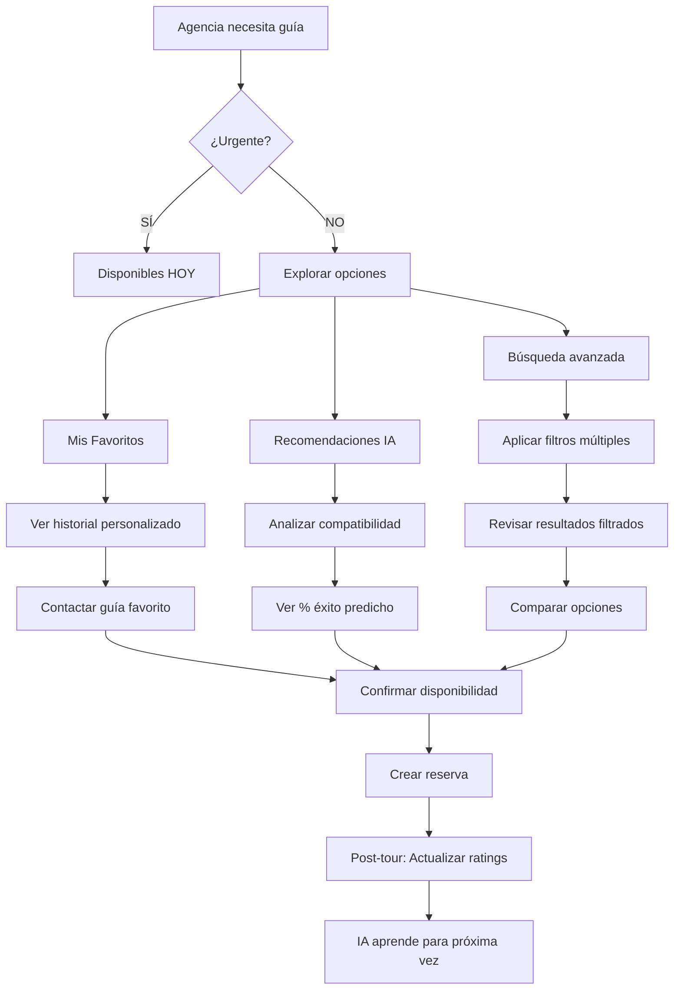

# 🥈 GESTIÓN DE GUÍAS MEJORADA - Casos de Uso Detallados

## 📋 **OVERVIEW**
**Prioridad**: 2 (Alta - Post MVP)  
**Objetivo**: Revolucionar cómo las agencias encuentran, evalúan y gestionan relaciones con guías  
**Impacto**: Reduce tiempo de selección de guías en 70% y mejora satisfacción de tours en 25%

---

## 🎯 **CASOS DE USO PRINCIPALES**

### **CU-GM-001: Lista de Guías Favoritos con Historial**

#### **Actor Principal**: Agencia B2B
#### **Descripción**: Como agencia, quiero mantener una lista personalizada de mis guías favoritos con historial detallado para reutilizar talento probado.

#### **Precondiciones**:
- Usuario autenticado como agencia
- Al menos 1 tour completado con guías
- Sistema con historial de interacciones disponible

#### **Flujo Principal**:
1. Agencia accede a sección "Mis Guías Favoritos"
2. Sistema muestra lista personalizada con:
   - **Foto y nombre del guía**
   - **Rating personalizado** (basado en mi experiencia)
   - **Última colaboración** (fecha y tipo de tour)
   - **Total de tours juntos** (número)
   - **Especialidades principales** (tags)
   - **Disponibilidad próximos 7 días** (semáforo: 🟢🟡🔴)
3. Agencia puede:
   - ⭐ **Marcar/desmarcar como favorito**
   - 📊 **Ver historial completo** de colaboraciones
   - 💬 **Contactar directamente**
   - 📅 **Ver disponibilidad detallada**

#### **Postcondiciones**:
- Lista actualizada en tiempo real
- Historial accesible para análisis
- Preferencias guardadas permanentemente

#### **Casos Alternativos**:
- **CU-GM-001.1**: Si no hay guías favoritos → Mostrar recomendaciones basadas en historial
- **CU-GM-001.2**: Si guía favorito ya no está disponible → Sugerir alternativas similares

#### **Criterios de Aceptación**:
```gherkin
DADO que soy una agencia con historial de tours
CUANDO accedo a "Mis Guías Favoritos"
ENTONCES veo una lista personalizada con:
  Y cada guía muestra foto, nombre y rating personalizado
  Y puedo ver cuántos tours hemos hecho juntos
  Y veo su disponibilidad para los próximos 7 días
  Y puedo contactarlos directamente desde ahí
```

---

### **CU-GM-002: Guías Disponibles HOY - Búsqueda Inteligente**

#### **Actor Principal**: Agencia B2B
#### **Descripción**: Como agencia, necesito encontrar guías disponibles HOY con filtros avanzados para resolver necesidades urgentes o de último momento.

#### **Precondiciones**:
- Usuario autenticado como agencia
- Existen guías con disponibilidad actualizada
- Geolocalización habilitada (opcional)

#### **Flujo Principal**:
1. Agencia selecciona "Buscar Guías HOY"
2. Sistema muestra **dashboard en tiempo real**:
   ```
   🟢 23 guías disponibles HOY
   🟡 12 guías con disponibilidad parcial  
   🔴 8 guías ocupados todo el día
   ```
3. **Filtros Inteligentes Disponibles**:
   - 📍 **Ubicación**: "A menos de 15km de mi ubicación"
   - 🕐 **Horario**: "Disponible desde las 14:00"
   - 🗣️ **Idiomas**: "Inglés fluido + Básico francés"
   - ⭐ **Rating mínimo**: "4.5 estrellas o más"
   - 💰 **Presupuesto**: "Entre $50-80 por día"
   - 🎯 **Especialidad**: "Tours gastronómicos"
   - 📊 **Mi experiencia**: "Solo guías que YA trabajaron conmigo"

4. **Resultados Ordenados por**:
   - **Compatibilidad IA**: Algoritmo que considera historial + preferencias
   - **Proximidad geográfica**
   - **Rating personalizado** vs rating general
   - **Respuesta rápida** (guías que responden en <30min)

#### **Postcondiciones**:
- Lista actualizada cada 5 minutos automáticamente
- Filtros guardados como "Búsqueda Rápida" para futuros usos
- Notificaciones push cuando guías favoritos se liberen

#### **Criterios de Aceptación**:
```gherkin
DADO que necesito un guía urgente para HOY
CUANDO uso la búsqueda "Disponibles HOY"
ENTONCES veo todos los guías disponibles en tiempo real
  Y puedo filtrar por ubicación, horario, idiomas, rating y precio
  Y los resultados se ordenan por compatibilidad conmigo
  Y veo cuáles responden rápido vs cuáles tardan más
  Y puedo guardar esta búsqueda para usar después
```

---

### **CU-GM-003: Rating Personalizado - "Tu Experiencia con [Guía]"**

#### **Actor Principal**: Agencia B2B
#### **Descripción**: Como agencia, quiero ver un rating personalizado basado en MI experiencia específica con cada guía, no solo el promedio general.

#### **Precondiciones**:
- Agencia ha trabajado al menos 1 vez con el guía
- Existen calificaciones guardadas en el sistema
- Datos suficientes para cálculo personalizado

#### **Flujo Principal**:
1. Agencia ve perfil de cualquier guía
2. Sistema muestra **DOBLE RATING**:
   ```
   🌟 Rating General: 4.2/5 (basado en 156 reviews)
   ⭐ TU experiencia: 4.8/5 (basado en 8 tours juntos)
   ```
3. **Desglose Personalizado**:
   - **Puntualidad contigo**: 95% a tiempo (vs 87% promedio)
   - **Calidad de servicio contigo**: 4.9/5 (vs 4.1/5 promedio)  
   - **Comunicación contigo**: 4.7/5 (vs 4.3/5 promedio)
   - **Flexibilidad contigo**: 4.8/5 (vs 4.0/5 promedio)

4. **Insights Personalizados**:
   - 💡 "Este guía funciona 23% mejor contigo que con otras agencias"
   - 📈 "Tu satisfacción con María ha mejorado 15% en los últimos 6 meses"
   - 🎯 "Especialidad óptima contigo: Tours culturales (4.9★) vs Tours aventura (4.2★)"

#### **Postcondiciones**:
- Rating personalizado se actualiza tras cada tour
- Comparaciones guardadas para análisis histórico
- Recomendaciones automáticas basadas en compatibilidad

#### **Criterios de Aceptación**:
```gherkin
DADO que he trabajado múltiples veces con un guía
CUANDO veo su perfil
ENTONCES veo MI rating personalizado separado del rating general
  Y veo cómo se compara mi experiencia vs otras agencias
  Y recibo insights sobre por qué funciona bien/mal conmigo
  Y veo en qué tipos de tour funciona mejor conmigo
```

---

### **CU-GM-004: Guías que Mejor Funcionan Contigo - IA Predictiva**

#### **Actor Principal**: Agencia B2B
#### **Descripción**: Como agencia, quiero que el sistema me recomiende automáticamente los guías que tienen mayor probabilidad de éxito basado en mi historial y tipo de tour.

#### **Precondiciones**:
- Agencia con historial mínimo de 10 tours
- Datos de preferencias y patrones identificables
- Algoritmo de ML entrenado con data histórica

#### **Flujo Principal**:
1. Agencia crea nueva reserva (especifica: fecha, tipo de tour, número de personas, presupuesto)
2. **Sistema IA analiza**:
   - ✅ Historial de la agencia
   - ✅ Tipo de tour solicitado  
   - ✅ Éxito previo por guía/tour type
   - ✅ Preferencias implícitas (horarios, zonas, estilos)
   - ✅ Disponibilidad real de guías

3. **Sistema muestra "Recomendaciones Inteligentes"**:
   ```
   🎯 PERFECTA COMPATIBILIDAD (95% éxito predicho)
   María González - Tours Gastronómicos
   "Has trabajado 12 veces juntos. Éxito: 100% a tiempo, 4.9★ promedio"
   
   🎯 ALTA COMPATIBILIDAD (87% éxito predicho)  
   Carlos Ruiz - Tours Culturales
   "Nuevo para ti, pero 94% compatible basado en tu perfil"
   
   🎯 BUENA OPCIÓN (78% éxito predicho)
   Ana López - Tours Aventura  
   "Funciona bien con agencias similares a tu perfil"
   ```

4. **Para cada recomendación muestra**:
   - 📊 **% de éxito predicho** y por qué
   - 🔍 **Razones específicas**: "Ambos prefieren tours de 4-6 horas"
   - ⚠️ **Posibles riesgos**: "Puede llegar 10min tarde ocasionalmente"
   - 💰 **Precio predicho** basado en negociaciones previas

#### **Postcondiciones**:
- Recomendaciones se mejoran con cada interacción
- Algoritmo aprende de éxitos/fracasos
- Agencia puede dar feedback para mejorar futuras recomendaciones

#### **Criterios de Aceptación**:
```gherkin
DADO que creo una nueva reserva
CUANDO el sistema analiza mis preferencias y historial
ENTONCES recibo recomendaciones ordenadas por probabilidad de éxito
  Y veo el % de compatibilidad predicha con cada guía
  Y entiendo las razones específicas de cada recomendación
  Y puedo ver potenciales riesgos antes de elegir
  Y el sistema aprende de mi elección final para mejorar
```

---

## 🔄 **FLUJOS DE INTERACCIÓN MEJORADOS**

### **Flujo Completo: Gestión Inteligente de Guías**



---

## 📊 **MÉTRICAS DE ÉXITO**

### **KPIs Técnicos**
- **Tiempo de selección de guía**: Reducir de 25min → 7min promedio
- **Tasa de confirmación**: Incrementar de 73% → 90%
- **Precisión de recomendaciones IA**: Alcanzar 85% de éxito predicho
- **Uso de favoritos**: 60% de reservas usan la lista de favoritos

### **KPIs de Negocio**
- **Retención de guías**: Incrementar colaboraciones repetidas 40%
- **Satisfacción post-tour**: Mejorar de 4.2★ → 4.6★ promedio
- **Cancelaciones de último momento**: Reducir 50%
- **Ingresos por agencia**: Incrementar 15% por mejor matching

---

## 🛠️ **CONSIDERACIONES TÉCNICAS**

### **Algoritmo de Recomendación IA**
```python
# Factores de compatibilidad (pesos)
compatibility_score = (
    historical_success * 0.35 +      # Éxito previo juntos
    tour_type_match * 0.25 +         # Especialidad del guía
    schedule_compatibility * 0.20 +   # Horarios preferidos
    communication_style * 0.10 +     # Estilo de comunicación
    price_range_fit * 0.10          # Rango de precios
)
```

### **Arquitectura de Datos**
- **Tabla**: `agency_guide_interactions`
- **Tabla**: `personalized_ratings` 
- **Tabla**: `compatibility_scores`
- **Cache Redis**: Para disponibilidad en tiempo real
- **ML Pipeline**: Para entrenar modelo de recomendaciones

### **APIs Necesarias**
- `GET /api/guides/favorites` - Lista de favoritos
- `GET /api/guides/available-today` - Disponibles hoy
- `GET /api/guides/{id}/personalized-rating` - Rating personalizado
- `GET /api/recommendations/guides` - Recomendaciones IA
- `POST /api/guides/{id}/add-favorite` - Agregar a favoritos

---

## 🎯 **ROADMAP DE IMPLEMENTACIÓN**

### **Fase 1 (Sprint 1-2)**: Favoritos Básicos
- Lista de guías favoritos
- Historial básico de colaboraciones
- Funcionalidad agregar/quitar favoritos

### **Fase 2 (Sprint 3-4)**: Búsqueda Avanzada
- Filtros "Disponibles HOY"
- Filtros avanzados (ubicación, horario, especialidad)
- Actualización en tiempo real

### **Fase 3 (Sprint 5-6)**: Rating Personalizado
- Cálculo de rating personalizado vs general
- Comparativas de rendimiento
- Insights personalizados

### **Fase 4 (Sprint 7-8)**: IA Predictiva
- Algoritmo de recomendación
- ML training pipeline
- Dashboard de compatibilidad

---

*Documento actualizado: Enero 2025*
*Próxima revisión: Abril 2025*